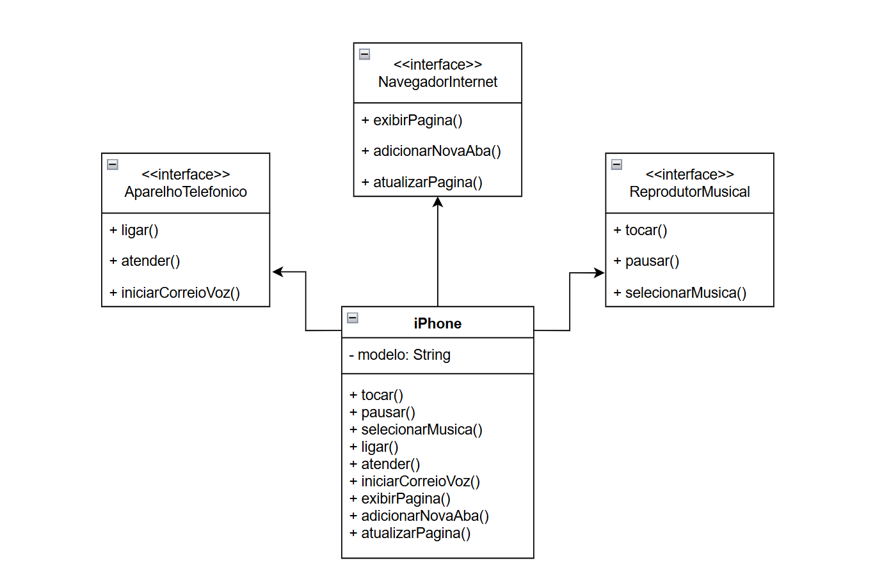

# Desafio de Modelagem e Programação Orientada a Objetos com Java

Este projeto é a solução para o desafio de modelagem e programação orientada a objetos (POO) proposto pela Digital Innovation One (DIO), que consiste em simular as funcionalidades de um **iPhone**.

O objetivo foi aplicar conceitos de Análise de Negócios, Requisitos, Modelagem UML e POO para criar uma representação digital das funções de **Reprodutor Musical**, **Aparelho Telefônico** e **Navegador de Internet**.

---

### 🚀 Tecnologias e Conceitos Utilizados

* **Linguagem de Programação:** Java
* **Modelagem:** Diagrama de Classes UML
* **Conceitos de POO:**
    * **Interfaces:** Utilizadas para definir os "contratos" de cada funcionalidade (Reprodutor Musical, Aparelho Telefônico, Navegador de Internet), garantindo que a classe `IPhone` implemente todos os métodos necessários.
    * **Herança (Implícita):** A classe `IPhone` "herda" o comportamento das interfaces, sendo obrigada a implementar todos os métodos.
    * **Encapsulamento:** Os métodos e suas implementações ficam encapsulados dentro da classe `IPhone`.
    * **Polimorfismo:** Uma instância de `IPhone` pode ser tratada como um `ReprodutorMusical`, um `AparelhoTelefonico` ou um `NavegadorInternet`, demonstrando as diferentes formas (polimorfismo) que o objeto pode assumir.

---

### 📐 Diagramação UML

A modelagem do projeto foi iniciada com a criação de um **Diagrama de Classes UML**. Este diagrama visualiza a estrutura do sistema, mostrando as relações entre as classes e interfaces antes de qualquer linha de código ser escrita.

A seguir, a representação do diagrama de classes:

**Diagrama de Classe do iPhone em UML - modelado em https://app.diagrams.net/*

*[Diagrama UML - puml](UML/iphone.puml)*

**Análise do Diagrama:**
* `ReprodutorMusical`, `AparelhoTelefonico` e `NavegadorInternet` são **interfaces** (indicadas pelo estereótipo `<<interface>>`). Elas definem um conjunto de métodos abstratos que devem ser implementados por qualquer classe que as utilize.
* A classe **`IPhone`** é a implementação concreta. As linhas indicam que `IPhone` **implementa** as três interfaces.
* A classe **`Main`** cria uma instância de `IPhone` e interage com seus métodos, servindo como ponto de entrada e teste do programa.

---

### 💻 Como Executar o Projeto

1.  Clone o repositório para a sua máquina local.
2.  Abra o projeto na sua IDE favorita (VS Code, Eclipse, IntelliJ, etc.).
3.  Certifique-se de que a estrutura de pacotes está correta.
4.  Execute a classe `Main.java`.

O console exibirá as saídas de cada método, demonstrando as funcionalidades do iPhone.

---

Feito por Mateus Santana - Conecte-se comigo no [LinkedIn](https://www.linkedin.com/in/mateusfsantana/) e no [GitHub](https://github.com/mateusfloressantana)!
